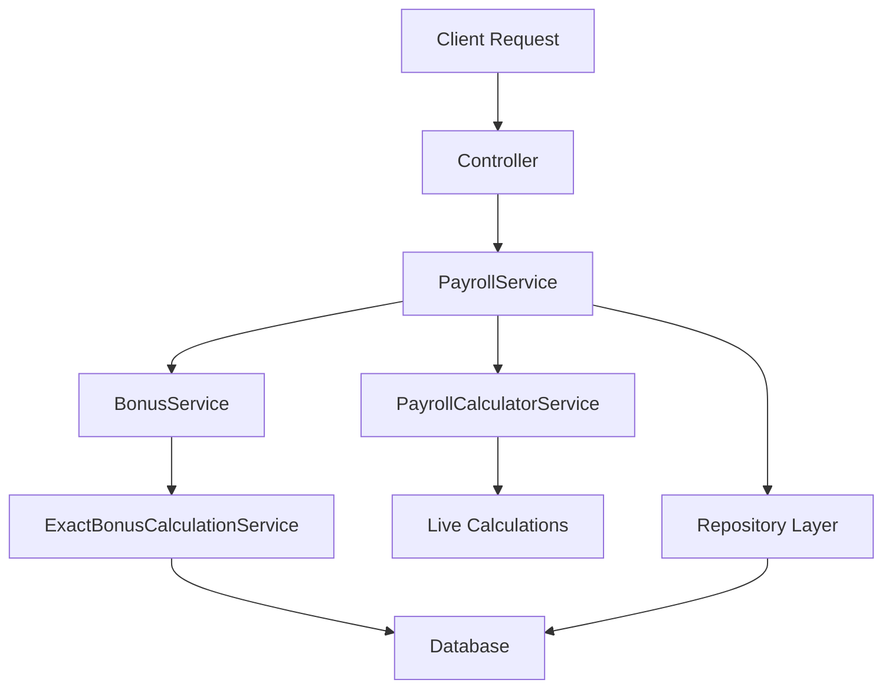
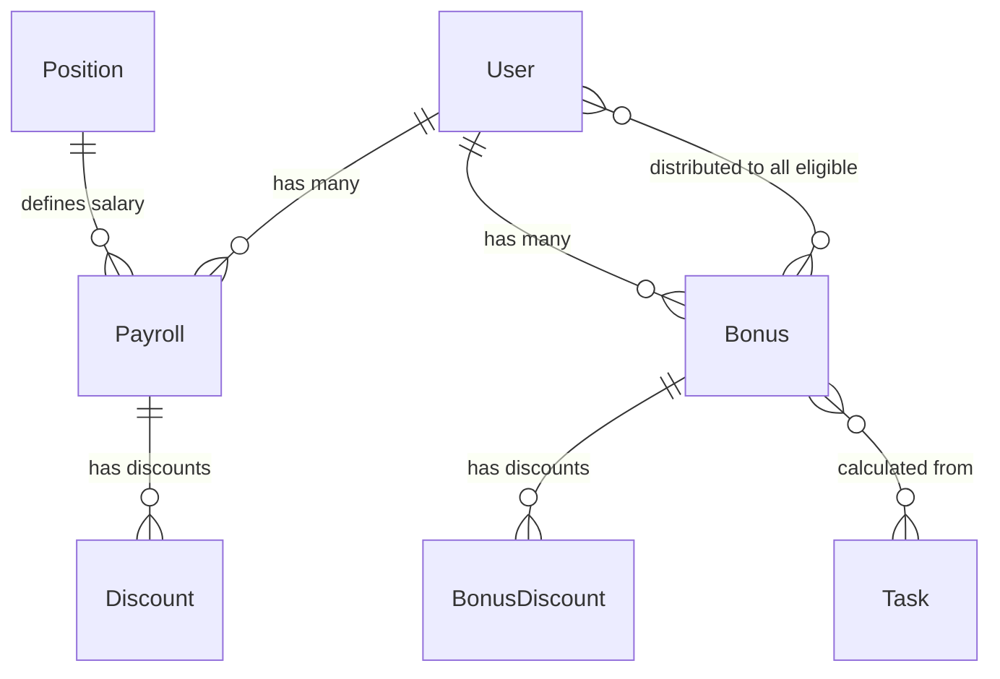

# Payroll and Bonus System Documentation

## Table of Contents

1. [Architecture Overview](#architecture-overview)
2. [Calculation Logic](#calculation-logic)
3. [Period Definitions](#period-definitions)
4. [Live vs Saved Data](#live-vs-saved-data)
5. [API Endpoints](#api-endpoints)
6. [Database Schema](#database-schema)
7. [Common Use Cases](#common-use-cases)
8. [Troubleshooting Guide](#troubleshooting-guide)

---

## Architecture Overview

The Ankaa payroll and bonus system is designed as a modular, event-driven architecture that supports both real-time calculations and persistent storage. The system is split across multiple modules to ensure separation of concerns and maintainability.

### Module Structure

```
modules/
├── administration/
│   ├── payroll/           # Payroll management (HR)
│   │   ├── payroll.service.ts
│   │   ├── payroll.controller.ts
│   │   ├── repositories/
│   │   └── utils/
│   │       └── payroll-calculator.ts
│   └── bonus/             # Bonus calculation (HR)
│       ├── bonus.service.ts
│       ├── bonus.controller.ts
│       ├── exact-bonus-calculation.service.ts
│       └── repositories/
└── domain/
    └── payroll/           # Business logic (Domain)
        └── README.md      # This file
```

### Key Components

1. **PayrollService** - Main orchestrator for payroll operations
2. **BonusService** - Handles bonus calculations and persistence
3. **ExactBonusCalculationService** - Implements the exact spreadsheet algorithm
4. **PayrollCalculatorService** - Utility service for all payroll math
5. **Repositories** - Data access layer with Prisma

### Data Flow



---

## Calculation Logic

### Payroll Calculation Formula

The payroll system uses a comprehensive calculation that includes base salary, bonuses, and deductions:

```
Gross Salary = Base Salary + Bonus Value
Total Deductions = Absence Deduction + Percentage Discounts + Fixed Discounts
Net Salary = Gross Salary - Total Deductions
```

### Bonus Calculation Algorithm

The bonus system implements an **exact spreadsheet algorithm** with the following components:

#### 1. Position-Based Matrix

Each position level (1-12) has predefined bonus values:
- **Junior I-IV** (Levels 1-4)
- **Pleno I-IV** (Levels 5-8)
- **Senior I-IV** (Levels 9-12)

#### 2. Performance Multiplier

Performance levels (1-5) affect the bonus calculation:
- Level 1: Base multiplier
- Level 2-5: Progressive increases

#### 3. Task Distribution Formula

The system calculates bonus based on sector-wide task distribution:

```typescript
// Get all eligible tasks in the period
const allTasks = await this.prisma.task.findMany({
  where: {
    commission: { in: [FULL_COMMISSION, PARTIAL_COMMISSION] },
    finishedAt: { gte: startDate, lte: endDate },
    status: COMPLETED
  }
});

// Calculate weighted task count
const weightedTasks = allTasks.reduce((sum, task) => {
  return sum + (task.commission === FULL_COMMISSION ? 1.0 : 0.5);
}, 0);

// Calculate average per eligible user
const averageTasksPerUser = weightedTasks / eligibleUsers.length;

// Apply to bonus matrix (scaled from base of 4 tasks)
const bonusValue = (matrixValue / 4) * averageTasksPerUser;
```

#### 4. Example Calculation

```typescript
// Example for Junior II, Performance Level 3, 6 average tasks
const positionLevel = 2; // Junior II
const performanceLevel = 3;
const averageTasksPerUser = 6;

// From matrix: Junior II Level 3 = R$ 304.55 (for 4 tasks)
const baseValue = 304.55;
const scaledValue = (baseValue / 4) * averageTasksPerUser;
// Result: (304.55 / 4) * 6 = R$ 456.83
```

### Deduction Calculation

Deductions are applied in a specific order:

1. **Absence Deduction** (first, based on base salary only)
2. **Percentage Discounts** (applied to remaining salary)
3. **Fixed Value Discounts** (applied after percentage discounts)
4. **Additional Deductions** (applied last)

```typescript
// Example deduction calculation
const baseSalary = 3000;
const bonusValue = 500;
const grossSalary = 3500;

// 1. Absence deduction (2 days out of 22 working days)
const absenceDeduction = (baseSalary / 22) * 2; // R$ 272.73

// 2. INSS discount (8% on remaining salary)
const remainingAfterAbsence = grossSalary - absenceDeduction; // R$ 3227.27
const inssDiscount = remainingAfterAbsence * 0.08; // R$ 258.18

// 3. Fixed uniform discount
const uniformDiscount = 50; // R$ 50.00

// Final calculation
const totalDeductions = 272.73 + 258.18 + 50; // R$ 580.91
const netSalary = 3500 - 580.91; // R$ 2919.09
```

---

## Period Definitions

### Bonus Period (26th to 25th)

The bonus calculation period runs from the **26th of the previous month to the 25th of the current month**. This ensures that:

- All completed tasks are included in the bonus calculation
- The period aligns with Brazilian business practices
- Month-end activities are properly captured

#### Examples

- **January 2024 Bonus**: December 26, 2023 → January 25, 2024
- **February 2024 Bonus**: January 26, 2024 → February 25, 2024
- **March 2024 Bonus**: February 26, 2024 → March 25, 2024

#### Implementation

```typescript
// Get start date (26th of previous month)
private getStartDate(year: number, month: number): Date {
  if (month === 1) {
    // For January, start from December 26 of previous year
    return new Date(year - 1, 11, 26);
  }
  return new Date(year, month - 2, 26); // month-2 because JS months are 0-indexed
}

// Get end date (25th of current month)
private getEndDate(year: number, month: number): Date {
  return new Date(year, month - 1, 25, 23, 59, 59, 999);
}
```

### Payroll Period

While bonus calculations use the 26th-25th period, payroll records can be generated for standard calendar months (1st-30th/31st) depending on business requirements.

---

## Live vs Saved Data

The system supports both **live calculations** and **saved data** to provide flexibility and performance.

### Live Data

Live data is calculated in real-time and provides:
- Current task counts and bonus projections
- Real-time payroll calculations without saving
- Immediate feedback for "what-if" scenarios
- No database persistence (temporary IDs used)

#### When Live Data is Used

1. **No saved payroll exists** for the requested period
2. **Admin requests live calculation** via `/live` endpoints
3. **Bonus simulation** scenarios
4. **Real-time dashboard** updates

#### Live Data Characteristics

```typescript
// Live payroll structure
{
  id: "live-{userId}-{year}-{month}",  // Temporary ID
  userId: "actual-user-id",
  year: 2024,
  month: 1,
  bonus: {
    id: "live-bonus-{userId}-{year}-{month}",
    baseBonus: 456.83,
    isLive: true,  // Key indicator
    performanceLevel: 3,
    weightedTaskCount: 6.0,
    taskCount: 15
  },
  calculatedAt: "2024-01-26T10:30:00Z"
}
```

### Saved Data

Saved data is persisted in the database and provides:
- Historical accuracy
- Audit trails
- Performance optimization
- Official payroll records

#### When Data is Saved

1. **Monthly cron job** (runs on 26th at 02:00)
2. **Manual bonus calculation** via admin interface
3. **Payroll generation** for specific periods
4. **HR approval workflows**

#### Saved Data Process

```typescript
// Monthly bonus calculation and save process
async calculateAndSaveBonuses(year: string, month: string) {
  const payrollData = await this.getPayrollData(year, month);

  await this.prisma.$transaction(async (tx) => {
    for (const bonusData of payrollData.bonuses) {
      // Create or update bonus record
      const bonus = await tx.bonus.upsert({
        where: { userId_year_month: {
          userId: bonusData.userId,
          year: parseInt(year),
          month: parseInt(month)
        }},
        create: bonusData,
        update: bonusData
      });

      // Link to all tasks and users for the period
      await this.linkBonusToTasksAndUsers(tx, bonus.id, year, month);
    }
  });
}
```

---

## API Endpoints

### Payroll Endpoints

#### Basic CRUD Operations

```http
# Get all payrolls (with pagination and filtering)
GET /api/payroll
Query Parameters:
  - page: number (default: 1)
  - limit: number (default: 10, max: 100)
  - year: number (optional)
  - month: number (optional)
  - userId: string (optional)
  - include: object (optional relations)

# Get specific payroll
GET /api/payroll/:id
Query Parameters:
  - include: object (optional relations)

# Create new payroll
POST /api/payroll
Body: PayrollCreateFormData

# Update existing payroll
PUT /api/payroll/:id
Body: PayrollUpdateFormData

# Delete payroll
DELETE /api/payroll/:id
```

#### Special Operations

```http
# Generate payrolls for all active users in a month
POST /api/payroll/generate-month
Body: {
  "year": 2024,
  "month": 1,
  "overwriteExisting": false
}

# Get live calculation for current user
GET /api/payroll/live
Query Parameters:
  - include: object (optional relations)

# Get live calculation for specific user/period
GET /api/payroll/live/:userId/:year/:month

# Get payrolls by user
GET /api/payroll/user/:userId

# Get payrolls by month
GET /api/payroll/month/:year/:month

# Get specific user's payroll for specific month
GET /api/payroll/user/:userId/month/:year/:month
```

#### Batch Operations

```http
# Batch create payrolls
POST /api/payroll/batch
Body: {
  "payrolls": PayrollCreateFormData[]
}

# Batch update payrolls
PUT /api/payroll/batch
Body: {
  "updates": { id: string, data: PayrollUpdateFormData }[]
}

# Batch delete payrolls
DELETE /api/payroll/batch
Body: {
  "ids": string[],
  "reason": string (optional)
}
```

### Bonus Endpoints

#### Basic Operations

```http
# Get bonus calculations for period
GET /api/bonus
Query Parameters:
  - year: string
  - month: string
  - userId: string (optional)

# Get bonus by ID
GET /api/bonus/:id

# Calculate and save bonuses for month
POST /api/bonus/calculate-and-save
Body: {
  "year": "2024",
  "month": "01"
}
```

#### Discount Management

```http
# Add discount to bonus
POST /api/bonus/:id/discounts
Body: {
  "reason": "Absence",
  "percentage": 10
}

# Remove discount from bonus
DELETE /api/bonus/discounts/:discountId
```

### Response Formats

All endpoints return standardized response formats:

```typescript
// Success Response
{
  "success": true,
  "message": "Operation completed successfully",
  "data": T, // Response data
  "meta": {  // For paginated responses
    "totalRecords": number,
    "page": number,
    "hasNextPage": boolean
  }
}

// Error Response
{
  "success": false,
  "message": "Error description in Portuguese",
  "error": {
    "code": "ERROR_CODE",
    "details": "Additional error information"
  }
}
```

---

## Database Schema

### Core Tables

#### Payroll Table

```sql
CREATE TABLE Payroll (
  id              STRING PRIMARY KEY DEFAULT uuid(),
  userId          STRING NOT NULL REFERENCES User(id),
  year            INTEGER NOT NULL,
  month           INTEGER NOT NULL,
  baseRemuneration DECIMAL(10,2) NOT NULL,
  positionId      STRING REFERENCES Position(id),
  status          PayrollStatus DEFAULT 'DRAFT',
  createdAt       TIMESTAMP DEFAULT now(),
  updatedAt       TIMESTAMP DEFAULT now(),

  UNIQUE(userId, year, month),
  INDEX(year, month),
  INDEX(userId),
  INDEX(status)
);
```

#### Bonus Table

```sql
CREATE TABLE Bonus (
  id               STRING PRIMARY KEY DEFAULT uuid(),
  userId           STRING NOT NULL REFERENCES User(id),
  year             INTEGER NOT NULL,
  month            INTEGER NOT NULL,
  performanceLevel INTEGER NOT NULL,
  baseBonus        DECIMAL(10,2) NOT NULL,
  payrollId        STRING REFERENCES Payroll(id),
  createdAt        TIMESTAMP DEFAULT now(),
  updatedAt        TIMESTAMP DEFAULT now(),

  UNIQUE(userId, year, month),
  INDEX(year, month),
  INDEX(userId),
  INDEX(performanceLevel)
);
```

#### Discount Tables

```sql
-- Payroll discounts
CREATE TABLE Discount (
  id               STRING PRIMARY KEY DEFAULT uuid(),
  payrollId        STRING NOT NULL REFERENCES Payroll(id),
  percentage       DECIMAL(5,2), -- NULL or 0-100
  value            DECIMAL(10,2), -- NULL or fixed amount
  reference        STRING NOT NULL, -- Description
  calculationOrder INTEGER NOT NULL DEFAULT 1,
  createdAt        TIMESTAMP DEFAULT now(),
  updatedAt        TIMESTAMP DEFAULT now(),

  INDEX(payrollId),
  INDEX(calculationOrder),
  CHECK ((percentage IS NOT NULL) OR (value IS NOT NULL))
);

-- Bonus discounts
CREATE TABLE BonusDiscount (
  id               STRING PRIMARY KEY DEFAULT uuid(),
  bonusId          STRING NOT NULL REFERENCES Bonus(id),
  percentage       DECIMAL(5,2), -- NULL or 0-100
  value            DECIMAL(10,2), -- NULL or fixed amount
  reference        STRING NOT NULL, -- Description
  calculationOrder INTEGER NOT NULL DEFAULT 1,
  createdAt        TIMESTAMP DEFAULT now(),
  updatedAt        TIMESTAMP DEFAULT now(),

  INDEX(bonusId),
  INDEX(calculationOrder),
  CHECK ((percentage IS NOT NULL) OR (value IS NOT NULL))
);
```

### Relationship Tables

#### Bonus-Task Relationships

```sql
-- Many-to-many: Bonus ↔ Task
CREATE TABLE _BonusToTask (
  A STRING NOT NULL REFERENCES Bonus(id),
  B STRING NOT NULL REFERENCES Task(id),

  PRIMARY KEY(A, B),
  INDEX(A),
  INDEX(B)
);

-- Many-to-many: Bonus ↔ User
CREATE TABLE _BonusToUser (
  A STRING NOT NULL REFERENCES Bonus(id),
  B STRING NOT NULL REFERENCES User(id),

  PRIMARY KEY(A, B),
  INDEX(A),
  INDEX(B)
);
```

### Key Relationships



---

## Common Use Cases

### 1. Monthly Payroll Generation

**Scenario**: HR needs to generate payrolls for all employees for January 2024.

```typescript
// API Call
POST /api/payroll/generate-month
{
  "year": 2024,
  "month": 1,
  "overwriteExisting": false
}

// Process:
// 1. Get all active users
// 2. Calculate live bonus data for each user
// 3. Create payroll records with base salary + bonus
// 4. Return summary of created/skipped records
```

### 2. Live Bonus Calculation

**Scenario**: Manager wants to see projected bonuses for the current month.

```typescript
// API Call
GET /api/payroll/month/2024/1

// Process:
// 1. Find existing payrolls for January 2024
// 2. For users without payrolls, generate live calculations
// 3. Include both saved and live data in response
// 4. Mark live data with isLive: true
```

### 3. Employee Payroll Lookup

**Scenario**: HR needs to review a specific employee's payroll details.

```typescript
// API Call
GET /api/payroll/user/123e4567-e89b-12d3-a456-426614174000/month/2024/1
?include={"user":true,"bonus":{"include":{"tasks":true}},"discounts":true}

// Response includes:
// - User details (name, position, sector)
// - Base salary from position remuneration
// - Bonus calculation breakdown
// - All tasks contributing to bonus
// - Applied discounts
// - Net salary calculation
```

### 4. Bonus Discount Application

**Scenario**: Employee had 2 days of absence, need to apply discount.

```typescript
// Step 1: Add absence discount to bonus
POST /api/bonus/bonus-id/discounts
{
  "reason": "Faltas - 2 dias",
  "percentage": 8.7 // (2 days / 23 working days) * 100
}

// Step 2: System recalculates bonus automatically
// Final bonus = original_bonus * (1 - 0.087)
```

### 5. Historical Comparison

**Scenario**: Compare payroll costs between two months.

```typescript
// Get January 2024 data
const jan2024 = await fetch('/api/payroll/month/2024/1');

// Get February 2024 data
const feb2024 = await fetch('/api/payroll/month/2024/2');

// Calculate differences
const comparison = {
  totalPayrollJan: jan2024.data.reduce((sum, p) => sum + p.netSalary, 0),
  totalPayrollFeb: feb2024.data.reduce((sum, p) => sum + p.netSalary, 0),
  difference: feb2024.total - jan2024.total,
  percentageChange: ((feb2024.total - jan2024.total) / jan2024.total) * 100
};
```

### 6. Bulk Payroll Updates

**Scenario**: Apply company-wide salary adjustment.

```typescript
// Get all payrolls for adjustment
const payrolls = await fetch('/api/payroll/month/2024/1');

// Prepare batch update with 5% increase
const updates = payrolls.data.map(payroll => ({
  id: payroll.id,
  data: {
    baseRemuneration: payroll.baseRemuneration * 1.05
  }
}));

// Execute batch update
POST /api/payroll/batch
{
  "updates": updates
}
```

---

## Troubleshooting Guide

### Common Issues

#### 1. Missing Live Bonus Data

**Symptoms**: Payroll shows zero bonus when it should have a value.

**Causes**:
- User's `performanceLevel` is 0 or null
- Position is not marked as `bonifiable`
- No eligible tasks completed in the period

**Solution**:
```typescript
// Check user performance level
const user = await prisma.user.findUnique({
  where: { id: userId },
  include: { position: true }
});

console.log('Performance Level:', user.performanceLevel); // Should be > 0
console.log('Position Bonifiable:', user.position?.bonifiable); // Should be true

// Check tasks for period
const tasks = await prisma.task.findMany({
  where: {
    finishedAt: { gte: startDate, lte: endDate },
    status: 'COMPLETED',
    commission: { in: ['FULL_COMMISSION', 'PARTIAL_COMMISSION'] }
  }
});
console.log('Eligible tasks:', tasks.length); // Should be > 0
```

#### 2. Incorrect Bonus Calculations

**Symptoms**: Bonus amounts don't match expected values from spreadsheet.

**Causes**:
- Position name mapping issues
- Incorrect task counting
- Wrong performance level

**Debugging**:
```typescript
// Get calculation details
const details = bonusCalculationService.getCalculationDetails(
  'Junior II',
  3,
  6.0
);

console.log('Calculation Details:', {
  positionLevel: details.positionLevel,
  matrixKey: details.matrixKey,
  baseMatrixValue: details.baseMatrixValue,
  taskCount: details.taskCount,
  finalBonus: details.bonusValue,
  formula: details.formula
});

// Expected output:
// {
//   positionLevel: 2,
//   matrixKey: "2.3",
//   baseMatrixValue: 304.55,
//   taskCount: 6.0,
//   finalBonus: 456.83,
//   formula: "Matrix[2.3] = R$ 304.55 (for 4 tasks) → scaled to 6 tasks = R$ 456.83"
// }
```

#### 3. Period Date Confusion

**Symptoms**: Tasks not appearing in bonus calculation despite being completed.

**Causes**:
- Misunderstanding of 26th-25th period
- Timezone issues
- Incorrect `finishedAt` timestamps

**Solution**:
```typescript
// Verify period dates
const period = payrollCalculatorService.calculatePayrollPeriod(1, 2024);
console.log('January 2024 Bonus Period:', {
  start: period.startDate, // 2023-12-26 00:00:00
  end: period.endDate,     // 2024-01-25 23:59:59
  display: period.displayPeriod // "26/12/2023 - 25/01/2024"
});

// Check if task falls in period
const taskDate = new Date('2024-01-20T14:30:00');
const inPeriod = taskDate >= period.startDate && taskDate <= period.endDate;
console.log('Task in period:', inPeriod); // Should be true
```

#### 4. Performance Issues with Large Datasets

**Symptoms**: Slow response times when generating monthly payrolls.

**Causes**:
- Too many database queries
- Missing database indexes
- Inefficient bonus calculations

**Optimization**:
```typescript
// Use batch processing for large user sets
const BATCH_SIZE = 50;
const users = await prisma.user.findMany({ where: { status: 'ACTIVE' }});

for (let i = 0; i < users.length; i += BATCH_SIZE) {
  const batch = users.slice(i, i + BATCH_SIZE);
  await Promise.all(
    batch.map(user => generateLivePayroll(user.id, year, month))
  );
}

// Add database indexes
CREATE INDEX CONCURRENTLY idx_task_finished_commission
ON Task (finishedAt, status, commission);

CREATE INDEX CONCURRENTLY idx_bonus_user_period
ON Bonus (userId, year, month);
```

#### 5. Transaction Timeout Issues

**Symptoms**: Database transaction timeouts during batch operations.

**Causes**:
- Long-running transactions
- Lock contention
- Large batch sizes

**Solution**:
```typescript
// Use smaller transaction batches
const TRANSACTION_BATCH_SIZE = 25;

for (let i = 0; i < bonuses.length; i += TRANSACTION_BATCH_SIZE) {
  const batch = bonuses.slice(i, i + TRANSACTION_BATCH_SIZE);

  await prisma.$transaction(async (tx) => {
    for (const bonus of batch) {
      await tx.bonus.create({ data: bonus });
    }
  }, {
    timeout: 30000, // 30 seconds
    maxWait: 5000   // 5 seconds max wait
  });
}
```

### Monitoring and Logging

#### Key Metrics to Monitor

1. **Calculation Performance**
   - Average time per payroll calculation
   - Bonus calculation errors
   - Database query performance

2. **Data Consistency**
   - Live vs saved data discrepancies
   - Missing bonus calculations
   - Orphaned records

3. **Business Metrics**
   - Total payroll costs per month
   - Bonus distribution by performance level
   - Average tasks per user

#### Logging Examples

```typescript
// Performance logging
const startTime = Date.now();
const result = await calculateBonusForUser(userId, year, month);
const duration = Date.now() - startTime;

logger.info('Bonus calculation completed', {
  userId,
  year,
  month,
  duration,
  bonusValue: result.baseBonus,
  taskCount: result.taskCount
});

// Error logging
try {
  await generateMonthlyPayrolls(year, month);
} catch (error) {
  logger.error('Monthly payroll generation failed', {
    year,
    month,
    error: error.message,
    stack: error.stack,
    timestamp: new Date().toISOString()
  });
  throw error;
}
```

### Data Validation Scripts

```typescript
// Validate bonus calculations
async function validateBonusCalculations(year: number, month: number) {
  const bonuses = await prisma.bonus.findMany({
    where: { year, month },
    include: { user: { include: { position: true }}}
  });

  const issues = [];

  for (const bonus of bonuses) {
    // Recalculate bonus
    const expectedBonus = await recalculateBonus(
      bonus.user.position.name,
      bonus.user.performanceLevel,
      year,
      month
    );

    // Check for discrepancies > R$ 0.01
    if (Math.abs(bonus.baseBonus - expectedBonus) > 0.01) {
      issues.push({
        userId: bonus.userId,
        userName: bonus.user.name,
        savedBonus: bonus.baseBonus,
        expectedBonus: expectedBonus,
        difference: bonus.baseBonus - expectedBonus
      });
    }
  }

  if (issues.length > 0) {
    logger.warn('Bonus calculation discrepancies found', { issues });
  }

  return issues;
}
```

---

## Integration Points

### Cron Jobs

The system integrates with scheduled jobs for automated operations:

```typescript
// Monthly bonus calculation (runs on 26th at 02:00)
@Cron('0 2 26 * *') // Every 26th at 2 AM
async handleMonthlyBonusCalculation() {
  const now = new Date();
  const year = now.getFullYear().toString();
  const month = (now.getMonth() + 1).toString().padStart(2, '0');

  try {
    const result = await this.bonusService.calculateAndSaveBonuses(year, month);
    this.logger.log(`Monthly bonus calculation completed: ${result.totalSuccess} success, ${result.totalFailed} failed`);
  } catch (error) {
    this.logger.error('Monthly bonus calculation failed:', error);
  }
}
```

### Change Logging

All payroll and bonus operations are logged for audit purposes:

```typescript
// Automatic change logging
await logEntityChange({
  changeLogService: this.changeLogService,
  entityType: ENTITY_TYPE.PAYROLL,
  entityId: payroll.id,
  action: CHANGE_ACTION.CREATE,
  entity: payroll,
  reason: `Folha de pagamento criada para ${month}/${year}`,
  userId,
  triggeredBy: CHANGE_TRIGGERED_BY.USER,
  transaction: tx,
});
```

### Notification System

The system can trigger notifications for important events:

```typescript
// Notify when bonus calculation is completed
await this.notificationService.create({
  title: 'Bônus Calculado',
  message: `Bônus de ${month}/${year} calculado com sucesso`,
  type: 'PAYROLL_BONUS_CALCULATED',
  userId: adminUserId,
  importance: 'MEDIUM'
});
```

This comprehensive documentation provides a complete understanding of the Ankaa payroll and bonus system, from high-level architecture to detailed troubleshooting guides. The system is designed to be robust, auditable, and maintainable while providing both real-time calculations and persistent storage for business needs.